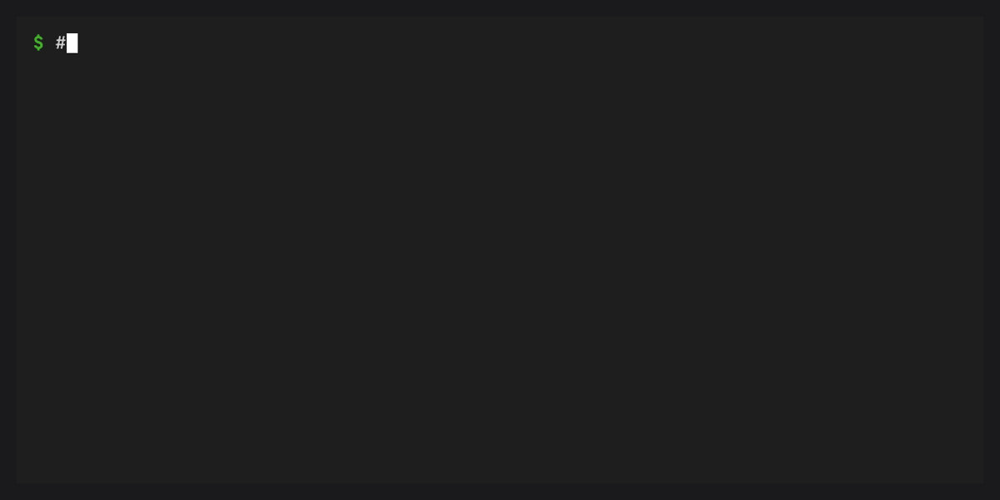

# Quick start

This guide walks you through protecting your base environment and
managing plugins with conda-self.

## Prerequisites

- conda 26.1.1 or later
- conda-self installed in base (`conda install -n base conda-self`)

## Protect your base environment


Using [conda doctor](inv:conda:std:doc#commands/doctor), check whether base is currently protected:

```bash
conda doctor base-protection
```

If it is not, enable protection:

```bash
conda doctor base-protection --fix
```

This does three things:

1. Clones your current base environment to a new `default` environment
2. Resets base to conda, its plugins, their dependencies, and any installer-provided packages
3. Freezes base so regular [conda install](inv:conda:std:doc#commands/install) cannot modify it

:::{tip}
You only need to run this once. After protection, use `conda self`
commands to manage plugins in base.
:::

## Install a plugin


```bash
conda self install conda-index
```

conda-self installs the package via subprocess, validates that it
registers as a [conda plugin](inv:conda:std:doc#dev-guide/plugins/index) (via entry points), and rolls back if
it does not.

## Update plugins

```bash
conda self update
```

This updates conda itself and all installed plugins to their latest
compatible versions.

## Remove a plugin


```bash
conda self remove conda-index
```

Essential packages (conda itself, its core dependencies) cannot be
removed.

## Reset base



If something goes wrong, reset base to essentials:

```bash
conda self reset
```

## Next steps

- {doc}`tutorials/protecting-base` -- A deeper walkthrough of base
  protection and what happens under the hood
- {doc}`tutorials/managing-plugins` -- Install, update, and remove
  plugins with confidence
- {doc}`features` -- How base protection, snapshots, and plugin
  validation work
- {doc}`reference/cli` -- Every command and flag
